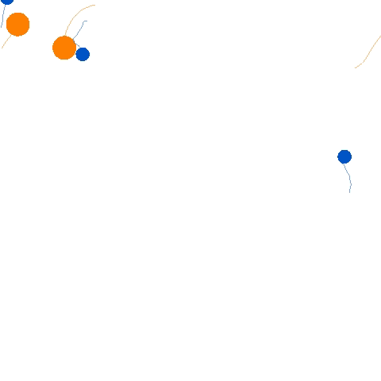
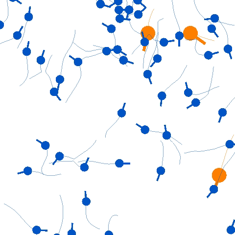

## Gym-PPS

[](https://github.com/WestlakeIntelligentRobotics/Gym-PPS/-/commits) [](https://GitHub.com/Naereen/StrapDown.js/graphs/commit-activity) [](https://juleskreuer.eu/citation-badge/) [](https://iopscience.iop.org/article/10.1088/1367-2630/acf33a)

Gym-PPS is a lightweight Predator-Prey Swarm environment seamlessly integrated into the standard Gym library. Its purpose is to provide a convenient platform for rapidly testing reinforcement learning algorithms and control algorithms utilized in guidance, swarming, or formation tasks.


## Citation

Gym-PPS appears  first in the paper 

```text
@article{li2023predator,
  title={Predator--prey survival pressure is sufficient to evolve swarming behaviors},
  author={Li, Jianan and Li, Liang and Zhao, Shiyu},
  journal={New Journal of Physics},
  volume={25},
  number={9},
  pages={092001},
  year={2023},
  publisher={IOP Publishing}
}
```


## Usage

Please note that the current version of Gym-PPS supports Python 3.8. Therefore, it is recommended to run the library within a Python 3.8 environment, which can be easily set up using a virtual environment such as `venv`.

We have plans to publish the project on PyPI in the near future. However, at this stage, the library needs to be manually installed.

```bash
python setup.py install
```

To quick start, run the following test example:

```bash
cd example_pps
python test_pps.py
```

A simulation window will pop up as follows:
<table>
  <tr>
    <td></td>
    <td></td>
  </tr>
  <tr>
    <td align="center">Cartesian Mode</td>
    <td align="center">Polar Mode</td>
  </tr>
</table>


## Simple Script to Start
Using Gym-PPS is quite simple: 

```python

## Define the Predator-Prey Swarm (PPS) environment
scenario_name = 'PredatorPreySwarm-v0'  

# customize PPS environment parameters in the .json file
custom_param = 'custom_param.json'      

## Make the environment 
env = gym.make(scenario_name)
custom_param = os.path.dirname(os.path.realpath(__file__)) + '/' + custom_param
env = PredatorPreySwarmCustomizer(env, custom_param)

## If NEEDED, Use the following wrappers to customize observations and reward functions 
# env = MyReward(MyObs(env))       

n_p = env.get_param('n_p')
n_e = env.n_e
s = env.reset()   # (obs_dim, n_peo)
for step in range(100):
    env.render( mode='human' )
    a_pred = np.random.uniform(-1,1,(2, n_p)) 
    a_prey = np.random.uniform(-1,1,(2, n_e))
    a = np.concatenate((a_pred, a_prey), axis=-1)
    s_, r, done, info = env.step(a)
    s = s_.copy()
```


## Customize Environment

To customize the parameters of the environment, such as the number of predators and the dynamics mode, you can easily specify the desired values in the `custom_param.json` file, as shown below:

```json
{
    "dynamics_mode": "Polar",
    "n_p": 3,
    "n_e": 10,
    "pursuer_strategy": "random",
    "escaper_strategy": "nearest",
    "is_periodic": true
}
```

You can also directly set or get the environment parameters:
```python
n_p = env.get_param('n_p')
env.set_param('n_p', 10)
```


## Customize Observation or Reward

To customize your own observation or reward functions, modify the functions in `custom_env.py`:

```python
class MyObs(gym.ObservationWrapper):

    def __init__(self, env):
        super().__init__(env)
        self.observation_space = spaces.Box(shape=(2, env.n_p+env.n_e), low=-np.inf, high=np.inf)

    def observation(self, obs):
        r"""Example::

        n_pe = self.env.n_p + self.env.n_e
        obs = np.ones((2, n_pe))
        return obs

        """
        return obs
        

class MyReward(gym.RewardWrapper):
    
    def reward(self, reward):
        r"""Example::

        reward = np.sum(self.env.is_collide_b2b)

        """
        
        return reward
```


## Parameter List

Below is a list of the parameters that can be customized:

| Parameter name          | Meaning                                                   | Default value |
| ----------------------- | --------------------------------------------------------- | ------------- |
| n_p                     | number of predators                                       | 3             |
| n_e                     | number of prey                                            | 10            |
| is_periodic             | whether the environment is periodic                       | True          |
| pursuer_strategy        | embedded pursuer control algorithm                        | 'input'       |
| escaper_strategy        | embedded prey control algorithm                           | 'input'       |
| penalize_control_effort | whether to penalize control effort in reward functions    | True          |
| penalize_collide_walls  | whether to penalize wall collision in reward functions    | False         |
| penalize_distance       | whether to penalize predator-prey distance in reward      | False         |
| penalize_collide_agents | whether to penalize agents collisions in reward functions | False         |
| FoV_p                   | Field of View for predators                               | 5             |
| FoV_e                   | Field of View for prey                                    | 5             |
| topo_n_p2e              | topological distance for predators seeing prey            | 5             |
| topo_n_e2p              | topological distance for prey seeing predators            | 2             |
| topo_n_p2p              | topological distance for predators seeing predators       | 2             |
| topo_n_e2e = 5          | topological distance for prey seeing prey                 | 5             |
| m_p                     | mass of predators                                         | 3             |
| m_e                     | mass of prey                                              | 1             |
| size_p                  | size of predators                                         | 0.06          |
| size_e                  | size of prey                                              | 0.035         |
| render_traj             | whether to render trajectories                            | True          |