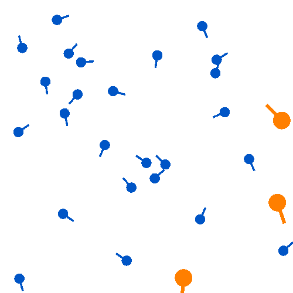
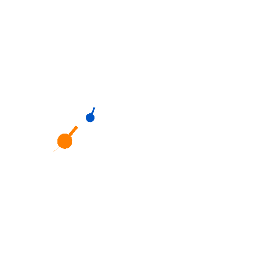
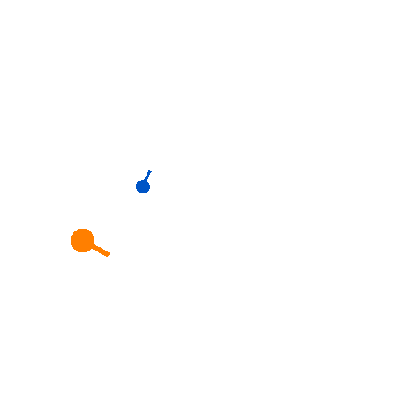
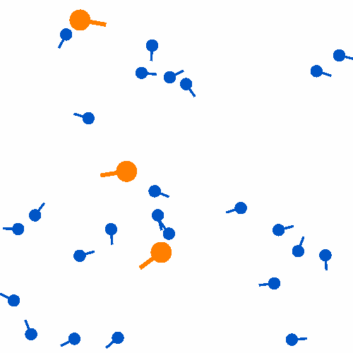

## Gym-PPS

 [](https://www.youtube.com/watch?v=Gt9v7cN6FII) [](https://www.bilibili.com/video/BV1zp4y1772H/) [](https://iopscience.iop.org/article/10.1088/1367-2630/acf33a) [](https://www.semanticscholar.org/paper/10.1088/1367-2630/acf33a)

Gym-PPS is a lightweight **Predator-Prey Swarm (PPS)** environment fully compatible with the standard **OpenAI Gym interface**. It is designed as an efficient platform for rapidly benchmarking **reinforcement learning** and **control** algorithms in guidance, swarming, and formation tasks. 🎥 **Milestone:** Our demonstration video on Bilibili has reached [](https://www.bilibili.com/video/BV1zp4y1772H/) views.

<table style="width: 80%;">
  <tr>
    <td align="center" style="width: 33.3%;">
      
    </td>
    <td align="center" style="width: 33.3%;">
      
    </td>
     <td align="center" style="width: 33.3%;">
      
    </td>
  </tr>
</table>


## Changelog

20260609: add tutorial example: 1v1 Predator-prey Game, Improve RL algorithm.

20251219: add tutorial examples: how to use PPS and implement RL algorithm; improve RL algorithm. 

20240805: update RL algorithm; update PPS gym environment.

20240501: Create the project **Predator-Prey Swarm.**


## Usage

Gym-PPS requires Python 3.8 for optimal performance. To ensure stability and avoid dependency conflicts, we strongly recommend running the library within a dedicated virtual environment. Currently, the library requires manual installation from the source.

Create and activate a Python 3.8 virtual environment:

```bash
python3.8 -m venv .venv-pps
source .venv-pps/bin/activate
```

Install the library: Navigate to the repository directory and install the package:

```bash
cd Gym-PPS-main
pip install .
```

To verify the installation and run a demo simulation, execute the following test script:

```bash
cd example_use_pps
python example1.py
```

A simulation window will pop up similar to the one shown below:

<table style="width: 60%;">
  <tr>
    <td align="center" style="width: 50%;">
      
    </td>
    <td align="center" style="width: 50%;">
      
    </td>
  </tr>
  <tr>
    <td align="center">Cartesian Mode</td>
    <td align="center">Polar Mode</td>
  </tr>
</table>


## Example 1: Quick Start Guide

Gym-PPS is designed for ease of use; refer to `example1.py` for a quick demonstration.

```bash
python example1.py
```

```python
## Define the Predator-Prey Swarm (PPS) environment
scenario_name = 'PredatorPreySwarm-v0'  

## customize PPS environment parameters in the .json file
custom_param = 'custom_param.json'      

## Make the environment 
env = gym.make(scenario_name)
custom_param = os.path.dirname(os.path.realpath(__file__)) + '/' + custom_param
env = PredatorPreySwarmCustomizer(env, custom_param)

if __name__ == '__main__':

    n_p = env.get_param('n_p')
    n_e = env.n_e
    n_pe = env.n_pe
    print("Number of predators: ", n_p)
    print("Number of prey: ", n_e)
    print("Number of total agents: ", n_pe)

    s = env.reset()   # (obs_dim, n_peo)
    print("Observation space shape: ", s.shape)
    print("Action space shape: ", env.action_space.shape)
    
    for _ in range(1):
        for step in range(1000):
            env.render( mode='human' )

            # To separately control 
            a_pred = np.random.uniform(-1,1,(2, n_p))       # predator action
            a_prey = np.random.uniform(-1,1,(2, n_e))       # prey action
            a = np.concatenate((a_pred, a_prey), axis=-1)   # total action

            s_, r, done, info = env.step(a)                 # state, reward, done, info
            s = s_                                          # update state
```

You can customize environment parameters, such as the number of predators or the dynamics mode, by modifying the `custom_param.json` file as shown below:

```json
{
    "dynamics_mode": "Polar",
    "n_p": 3,
    "n_e": 20,
    "pursuer_strategy": "random",
    "escaper_strategy": "nearest",
    "is_periodic": true
}
```

Alternatively, you can access or modify these parameters directly within your code:

```python
n_p = env.get_param('n_p')
env.set_param('n_p', 10)
```


## Example 2: Customize Observation, Reward & Action

To customize the observation or reward functions, please modify the definitions in `custom_env.py`. Refer to `example2.py` for guidance.

```bash
python example2.py
```

```python
## Use the following wrappers to customize reward, observation, and action functions 
env = MyReward(env, custom_param)
env = MyObs(env, custom_param)  

class MyObs(CustomObservation):

    # def __init__(self, env, args):
    #     super().__init__(env, args)
    #     self.observation_space = spaces.Box(shape=(2, env.n_p+env.n_e), low=-np.inf, high=np.inf)

    def observation(self, obs):
        r"""Example::

        obs = obs[6:, :]  # for example, remove ego-state
        # ⚠️ WARNING: Then your algorithm should stick to your own observation space !

        """
        # your code here
        obs = obs[6:, :]
        return obs
        

class MyReward(CustomReward):
    
    def reward(self, observation, reward, action):
        r"""Example::

        reward_p =   5.0 * self.env.is_collide_b2b[self.env.n_p:self.env.n_pe, :self.env.n_p].sum(axis=0, keepdims=True).astype(float)                      
        reward_e = - 1.0 * self.env.is_collide_b2b[self.env.n_p:self.env.n_pe, :self.env.n_p].sum(axis=1, keepdims=True).astype(float).reshape(1,self.env.n_e)  
        reward_e -= 0.1 * np.abs( action[[0], self.env.n_p:self.env.n_pe]) + 0.01 * np.abs( action[[1], self.env.n_p:self.env.n_pe])  
        reward = np.concatenate((reward_p, reward_e), axis=1)

        """
        # your code here
        return reward
```


## Example 3: Customize Environment (Advanced)

For more advanced customization, such as adding new methods or functions to the environment, modify the `MyEnv` class directly. See `example3.py` for implementation details.

```bash
python example3.py
```

```python
## Use the following wrapper to customize the environment class
env = MyEnv(env, custom_param)

class MyEnv(PredatorPreySwarmCustomizer):
    def __init__(self, env, args):
        super().__init__(env, args)

    ## example
    def compute_speed(self):
        speed = np.sqrt(self.env.dp[[0],:]**2 + self.env.dp[[1],:]**2)
        return speed
    
    def myfunc(self):
        # define your own function here 
        # your code here
        pass
```


## Example: 1v1 Predator-Prey Game

This repository includes a minimal DDPG example for a 1v1 predator-prey task. In the default setting, the prey remains static and the predator learns to catch the prey.

First, make sure `torch` is installed in your `.venv-pps` environment:

```bash
pip install torch
```

Then train the predator:

```bash
cd example_algorithm_1vs1
python train.py
```

Once training finishes, which should only take a few moments, evaluate the learned policy:

```bash
python eval.py --render
```

The following examples show the trained predator chasing a static prey and a randomly moving prey:

<table style="width: 60%;">
  <tr>
    <td align="center" style="width: 50%;">
      
    </td>
    <td align="center" style="width: 50%;">
      
    </td>
  </tr>
  <tr>
    <td align="center">Catching a static prey</td>
    <td align="center">Catching a randomly moving prey</td>
  </tr>
</table>


For an additional challenge, set `"escaper_strategy"` to `"random"` in `example_algorithm_1vs1/custom_param.json`, retrain the policy, and check whether the predator can still catch the prey, or performs better.


## Implementation of NJP algorithm

This repository also provides a reference implementation of the MARL algorithm for the PPS environment, adapted from “Predator-prey survival pressure is sufficient to evolve swarming behaviors” *(New Journal of Physics).* 

To train the swarm, first ensure `torch` is installed in the `.venv-pps`

```bash
pip install torch
```

Then run

```bash
cd example_algorithm_NJP
python train.py
```

The training should start immediately. Go grab a coffee, but make it an espresso because this won't take long. Afterward, increase `n_e` up to `25`  in `custom_param.json`, then run 

```bash
python eval.py --render
```

to see the prey agents embrace the swarm mind:

<table style="width: 60%;">
  <tr>
    <td align="center" style="width: 50%;">
      
    </td>
    <td align="center" style="width: 50%;">
      
    </td>
  </tr>
  <tr>
    <td align="center">After Training</td>
    <td align="center">After Training</td>
  </tr>
</table>


We hope you enjoy this project. Should you find it helpful for your research, we would appreciate your citation of the following paper, which helps other researchers find us.


## Save the Frames

Gym-PPS can save rendered frames as PNG files during evaluation or visualization. Enable frame saving in your `custom_param.json`:

```json
{
    "save_frame": true,
    "frame_dir": "./frames"
}
```

Frames are written when `env.render(mode="human")` is called. After running your script, the selected `frame_dir` will contain numbered PNG files such as `0.png`, `1.png`, and `2.png`.


## Paper Information [](https://iopscience.iop.org/article/10.1088/1367-2630/acf33a)

Gym-PPS appears first in the paper 

```text
@article{li2023predator,
  title={Predator--prey survival pressure is sufficient to evolve swarming behaviors},
  author={Li, Jianan and Li, Liang and Zhao, Shiyu},
  journal={New Journal of Physics},
  volume={25},
  number={9},
  pages={092001},
  year={2023},
  publisher={IOP Publishing}
}
```


## Parameter List

Below is a list of the parameters that can be customized:

| Parameter name          | Meaning                                                   | Default value |
| ----------------------- | --------------------------------------------------------- | ------------- |
| n_p                     | number of predators                                       | 3             |
| n_e                     | number of prey                                            | 10            |
| is_periodic             | whether the environment is periodic                       | True          |
| pursuer_strategy        | embedded pursuer control algorithm                        | 'input'       |
| escaper_strategy        | embedded prey control algorithm                           | 'input'       |
| penalize_control_effort | whether to penalize control effort in reward functions    | True          |
| penalize_collide_walls  | whether to penalize wall collision in reward functions    | False         |
| penalize_distance       | whether to penalize predator-prey distance in reward      | False         |
| penalize_collide_agents | whether to penalize agents collisions in reward functions | False         |
| FoV_p                   | Field of View for predators                               | 5             |
| FoV_e                   | Field of View for prey                                    | 5             |
| topo_n_p2e              | topological distance for predators seeing prey            | 5             |
| topo_n_e2p              | topological distance for prey seeing predators            | 2             |
| topo_n_p2p              | topological distance for predators seeing predators       | 2             |
| topo_n_e2e = 5          | topological distance for prey seeing prey                 | 5             |
| m_p                     | mass of predators                                         | 3             |
| m_e                     | mass of prey                                              | 1             |
| size_p                  | size of predators                                         | 0.06          |
| size_e                  | size of prey                                              | 0.035         |
| render_traj             | whether to render trajectories                            | True          |
| save_frame              | whether to save rendered frame                            | False         |
| frame_dir               | where to save rendered frame                              | "./frames"    |
